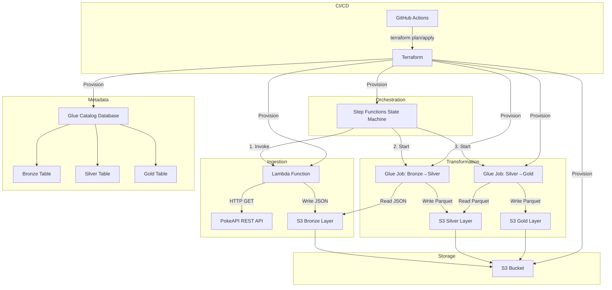
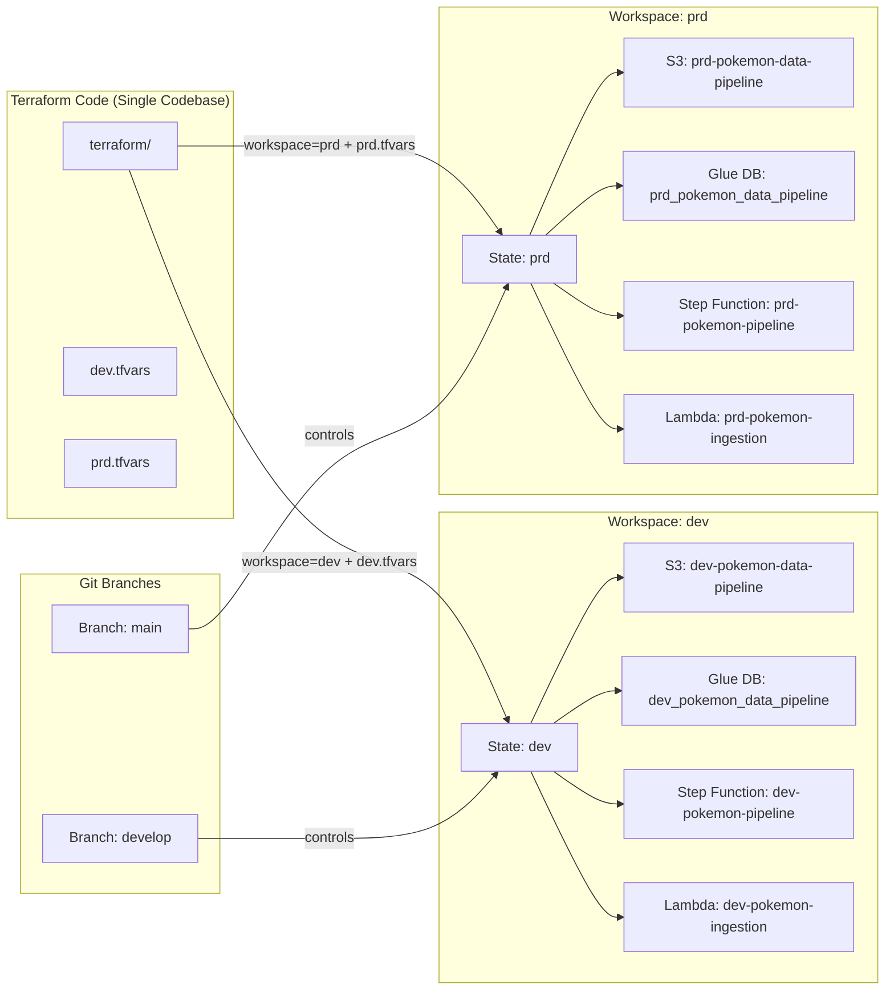
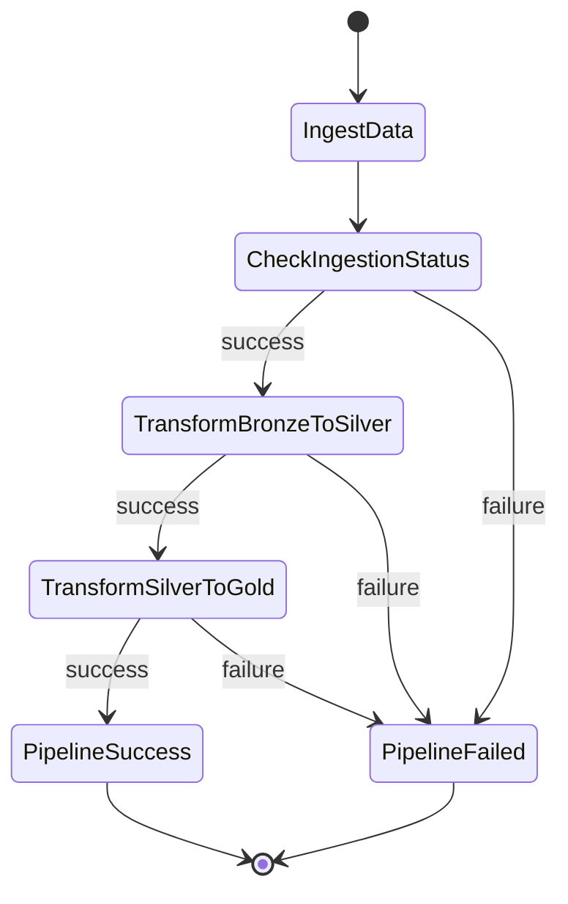

# Design Document: Terraform Data Pipeline

## Overview

This design describes a serverless data pipeline on AWS that ingests Pokémon data from PokeAPI, transforms it through the Medallion Architecture (Bronze → Silver → Gold), and makes it available for analytics. All infrastructure is provisioned with Terraform, orchestrated by AWS Step Functions, and deployed via GitHub Actions CI/CD.

The pipeline follows a clear separation of concerns:
- **Ingestion**: AWS Lambda fetches raw data from PokeAPI and stores it as JSON in S3 (Bronze layer)
- **Transformation**: AWS Glue Jobs transform data between layers using PySpark
- **Orchestration**: AWS Step Functions coordinates the sequential execution of pipeline stages
- **Infrastructure**: Terraform modules define all AWS resources with least-privilege IAM
- **CI/CD**: GitHub Actions validates and deploys infrastructure changes

## Architecture



### Multi-Environment Architecture

The pipeline supports two isolated environments (**dev** and **prd**) within the same AWS account using Terraform workspaces. Each environment is directly controlled by a specific Git branch:

- **Branch_Develop** → Terraform workspace `dev` + `dev.tfvars` → **Ambiente_Dev**
- **Branch_Main** → Terraform workspace `prd` + `prd.tfvars` → **Ambiente_Prd**

This eliminates code duplication while ensuring resource isolation and provides a clear 1:1 mapping between branches and environments.



**Workspace Strategy (Branch-to-Environment Mapping)**:
- **Branch_Develop**: `terraform workspace select dev` + `terraform apply -var-file=dev.tfvars` → provisions dev resources
- **Branch_Main**: `terraform workspace select prd` + `terraform apply -var-file=prd.tfvars` → provisions prd resources
- Each workspace maintains its own independent Terraform state file in the remote backend
- Each branch independently manages only its own environment — no cross-environment promotion workflow

**Resource Naming Convention**:
All resource names include `terraform.workspace` as a prefix to prevent collisions:
```hcl
locals {
  env         = terraform.workspace
  name_prefix = "${local.env}-pokemon"
}
```

| Resource | Naming Pattern | Dev Example | Prd Example |
|----------|---------------|-------------|-------------|
| S3 Bucket | `${env}-pokemon-data-pipeline-${account_id}` | `dev-pokemon-data-pipeline-123456` | `prd-pokemon-data-pipeline-123456` |
| Glue Database | `${env}_pokemon_data_pipeline` | `dev_pokemon_data_pipeline` | `prd_pokemon_data_pipeline` |
| Step Function | `${env}-pokemon-pipeline` | `dev-pokemon-pipeline` | `prd-pokemon-pipeline` |
| Lambda Function | `${env}-pokemon-ingestion` | `dev-pokemon-ingestion` | `prd-pokemon-ingestion` |
| IAM Roles | `${env}-pokemon-{service}-role` | `dev-pokemon-lambda-role` | `prd-pokemon-lambda-role` |

**Environment-Specific Resource Sizing**:

| Resource | Dev (dev.tfvars) | Prd (prd.tfvars) |
|----------|-----------------|-----------------|
| Lambda Memory | 256 MB | 512 MB |
| Lambda Timeout | 10 min | 15 min |
| Glue DPUs | 2 (G.1X) | 5 (G.1X) |
| Glue Timeout | 30 min | 60 min |
| S3 Lifecycle (Bronze) | 30 days | 90 days |
| S3 Lifecycle (Silver) | 60 days | 180 days |
| S3 Lifecycle (Gold) | 90 days | 365 days |

### Design Decisions

1. **Single S3 bucket with prefix separation** over multiple buckets: Simplifies IAM policies, lifecycle management, and Terraform state. Each layer uses a dedicated prefix (`bronze/`, `silver/`, `gold/`).

2. **Parquet for Silver and Gold layers**: Column-oriented format provides efficient compression and query performance for analytics via Athena.

3. **Separate Glue Jobs per transformation stage**: Isolates failures, enables independent retry, and allows different resource configurations per stage.

4. **Lambda for ingestion over Glue**: Lambda is more cost-effective for HTTP-based API calls and handles the pagination/rate-limiting logic more naturally than a Spark job.

5. **Step Functions Express over Standard**: The pipeline runs sequentially with defined timeouts, making Express workflows suitable if execution time stays under 5 minutes. However, given the 15-minute Lambda timeout and 60-minute Glue timeouts, **Standard Workflows** are required.

6. **Terraform Workspaces over separate directories/repos**: Using workspaces within a single codebase avoids duplication, reduces drift risk, and simplifies the CI/CD pipeline. Each workspace gets its own state file in the same S3 backend, keyed by workspace name.

7. **Separate tfvars files over inline workspace conditionals**: Using `dev.tfvars` and `prd.tfvars` keeps environment-specific values explicit and auditable, rather than embedding complex conditional logic throughout the HCL code.

## Components and Interfaces

### 1. Lambda Ingestion Function

**Runtime**: Python 3.12  
**Timeout**: 15 minutes  
**Memory**: 512 MB

**Module structure**:
```
src/lambda/
├── handler.py          # Entry point, orchestrates ingestion flow
├── pokeapi_client.py   # HTTP client with retry and rate limiting
├── s3_writer.py        # S3 write operations with partitioning
└── models.py           # Data models for Pokemon responses
```

**Interfaces**:
- **Input** (from Step Functions): `{ "pokedex_start": 1, "pokedex_end": 151, "execution_date": "YYYY-MM-DD" }` (execution_date is optional, defaults to today)
- **Output** (to Step Functions): `{ "status": "success|partial_failure|failure", "pokemon_count": int, "failed_pokemon": [str], "s3_prefix": str }`

**Key behaviors**:
- Receives a Pokédex range (start/end) and fetches details for each Pokémon by ID
- Fetches individual Pokémon details from `/api/v2/pokemon/{id}` with 500ms minimum interval between requests
- Max 100 requests/minute rate limiting
- Exponential backoff retry (3 attempts) on HTTP errors
- Saves one JSON file per Pokémon: `bronze/YYYY/MM/DD/{pokemon_name}.json`
- Monitors execution time; saves partial results at 80% timeout threshold
- execution_date defaults to current date if not provided in the event

### 2. Glue Job: Bronze to Silver

**Runtime**: Python 3.9 (Glue 4.0, PySpark)  
**Workers**: 2 G.1X  
**Timeout**: 60 minutes

**Module structure**:
```
src/glue/
├── bronze_to_silver.py      # Glue job entry point
├── transformations/
│   ├── deduplication.py     # Remove duplicates by Pokemon ID
│   ├── type_standardization.py  # Standardize data types
│   └── null_handling.py     # Handle null/invalid values
└── utils/
    └── spark_helpers.py     # Shared PySpark utilities
```

**Transformation logic** (pure functions: DataFrame → DataFrame):
- `deduplicate(df, key="id")` → removes duplicate records
- `standardize_types(df)` → converts numeric fields to int, name to lowercase, list fields to arrays
- `handle_nulls(df)` → replaces null numerics with 0, null text with ""

**Output**: Parquet files partitioned by primary Pokémon type at `silver/type={type}/`

### 3. Glue Job: Silver to Gold

**Runtime**: Python 3.9 (Glue 4.0, PySpark)  
**Workers**: 2 G.1X  
**Timeout**: 60 minutes

**Module structure**:
```
src/glue/
├── silver_to_gold.py        # Glue job entry point
└── transformations/
    └── aggregations.py      # Aggregation logic
```

**Transformation logic** (pure functions: DataFrame → DataFrame):
- `aggregate_by_type(df)` → groups by Pokémon type, calculates count, avg, min, max for numeric attributes

**Output**: Parquet files at `gold/type={type}/`

### 4. Step Functions State Machine

**Type**: Standard Workflow



**States**:
- `IngestData`: Invokes Lambda function (timeout: 15 min)
- `CheckIngestionStatus`: Choice state evaluating Lambda response status
- `TransformBronzeToSilver`: Starts Glue Job sync (timeout: 60 min)
- `TransformSilverToGold`: Starts Glue Job sync (timeout: 60 min)
- `PipelineSuccess`: Terminal success state with execution metadata
- `PipelineFailed`: Terminal failure state with diagnostic info (step name, error message, execution ARN)

### 5. Terraform Modules

```
terraform/
├── main.tf                  # Root module, backend config, workspace locals
├── variables.tf             # Root variables (env-agnostic definitions)
├── outputs.tf               # Root outputs
├── dev.tfvars               # Dev environment values (reduced sizing)
├── prd.tfvars               # Prd environment values (production sizing)
├── backend.tf               # Remote backend config (S3 + DynamoDB)
├── locals.tf                # Workspace-derived locals (env, name_prefix, tags)
├── modules/
│   ├── s3/
│   │   ├── main.tf          # Bucket, prefixes, lifecycle, encryption
│   │   ├── variables.tf
│   │   └── outputs.tf
│   ├── lambda/
│   │   ├── main.tf          # Function, layers, environment vars
│   │   ├── variables.tf
│   │   └── outputs.tf
│   ├── glue/
│   │   ├── main.tf          # Jobs, catalog database, tables
│   │   ├── variables.tf
│   │   └── outputs.tf
│   ├── step_functions/
│   │   ├── main.tf          # State machine definition
│   │   ├── variables.tf
│   │   └── outputs.tf
│   └── iam/
│       ├── main.tf          # Roles, policies per service
│       ├── variables.tf
│       └── outputs.tf
```

#### Backend Configuration (Workspace-Aware)

```hcl
# backend.tf
terraform {
  backend "s3" {
    bucket         = "terraform-state-pokemon-pipeline"
    key            = "pokemon-data-pipeline/terraform.tfstate"
    region         = "us-east-1"
    dynamodb_table = "terraform-lock-pokemon-pipeline"
    encrypt        = true
  }
}
```

Terraform workspaces automatically namespace the state key as:
`env:/{workspace}/pokemon-data-pipeline/terraform.tfstate`

This ensures `dev` and `prd` states are completely isolated in the same S3 backend bucket.

#### Workspace Locals

```hcl
# locals.tf
locals {
  env         = terraform.workspace
  name_prefix = "${local.env}-pokemon"

  common_tags = {
    Project     = "pokemon-data-pipeline"
    Environment = local.env
    ManagedBy   = "terraform"
    Workspace   = terraform.workspace
  }
}
```

#### Environment-Specific tfvars

**dev.tfvars**:
```hcl
# Development environment - reduced sizing for cost efficiency
lambda_memory_size    = 256
lambda_timeout        = 600    # 10 minutes
glue_number_of_workers = 2
glue_worker_type      = "G.1X"
glue_timeout          = 30     # minutes
s3_bronze_retention_days = 30
s3_silver_retention_days = 60
s3_gold_retention_days   = 90
s3_noncurrent_expiration_days = 7
```

**prd.tfvars**:
```hcl
# Production environment - full capacity for workloads
lambda_memory_size    = 512
lambda_timeout        = 900    # 15 minutes
glue_number_of_workers = 5
glue_worker_type      = "G.1X"
glue_timeout          = 60     # minutes
s3_bronze_retention_days = 90
s3_silver_retention_days = 180
s3_gold_retention_days   = 365
s3_noncurrent_expiration_days = 30
```

#### Resource Tagging Strategy

All resources provisioned by Terraform receive a standard tag set derived from `local.common_tags`:

```hcl
resource "aws_s3_bucket" "data" {
  bucket = "${local.name_prefix}-data-pipeline-${data.aws_caller_identity.current.account_id}"

  tags = local.common_tags
}
```

The `Environment` tag (value: `dev` or `prd`) enables:
- Cost allocation and reporting per environment
- IAM policy conditions scoping access by environment tag
- CloudWatch dashboard filtering by environment

### 6. GitHub Actions Workflows

```
.github/workflows/
├── terraform-plan.yml       # PR: fmt, validate, plan (workspace based on target branch)
└── terraform-apply.yml      # Merge: fmt, validate, plan, apply (workspace based on merged branch)
```

**Branch-to-Environment CI/CD Mapping**:

Each branch independently controls its own environment. There is no cross-environment promotion or sequential deployment.

| Trigger | Target Branch | Workspace | Tfvars File | Action |
|---------|---------------|-----------|-------------|--------|
| PR opened/updated | `main` | `prd` | `prd.tfvars` | `terraform plan` → PR comment |
| PR opened/updated | `develop` | `dev` | `dev.tfvars` | `terraform plan` → PR comment |
| Merge | `main` | `prd` | `prd.tfvars` | `terraform apply` |
| Merge | `develop` | `dev` | `dev.tfvars` | `terraform apply` |

**Workflow Logic** (`terraform-plan.yml`):
```yaml
on:
  pull_request:
    branches: [main, develop]

# Determine workspace and tfvars based on target branch
env:
  TF_WORKSPACE: ${{ github.base_ref == 'main' && 'prd' || 'dev' }}
  TF_VAR_FILE: ${{ github.base_ref == 'main' && 'prd.tfvars' || 'dev.tfvars' }}
```

```bash
terraform workspace select $TF_WORKSPACE
terraform plan -var-file=$TF_VAR_FILE
```

**Workflow Logic** (`terraform-apply.yml`):
```yaml
on:
  push:
    branches: [main, develop]

# Determine workspace and tfvars based on which branch received the merge
env:
  TF_WORKSPACE: ${{ github.ref_name == 'main' && 'prd' || 'dev' }}
  TF_VAR_FILE: ${{ github.ref_name == 'main' && 'prd.tfvars' || 'dev.tfvars' }}
```

```bash
terraform workspace select $TF_WORKSPACE
terraform apply -auto-approve -var-file=$TF_VAR_FILE
```

**Key Design Decisions**:
- A PR to `main` triggers plan **only** for the `prd` workspace — it does not plan `dev`
- A PR to `develop` triggers plan **only** for the `dev` workspace — it does not plan `prd`
- Merging to `main` applies **only** to `prd` — no dev deployment occurs
- Merging to `develop` applies **only** to `dev` — no prd deployment occurs
- No manual approval gate between environments; each branch is autonomous

## Data Models

### Raw PokeAPI Response (Bronze Layer - JSON)

```json
{
  "id": 1,
  "name": "bulbasaur",
  "height": 7,
  "weight": 69,
  "base_experience": 64,
  "types": [
    { "slot": 1, "type": { "name": "grass", "url": "..." } },
    { "slot": 2, "type": { "name": "poison", "url": "..." } }
  ],
  "abilities": [
    { "ability": { "name": "overgrow", "url": "..." }, "is_hidden": false, "slot": 1 }
  ],
  "stats": [
    { "base_stat": 45, "effort": 0, "stat": { "name": "hp", "url": "..." } }
  ]
}
```

### Silver Layer Schema (Parquet)

| Column | Type | Description |
|--------|------|-------------|
| id | INT | Unique Pokémon identifier |
| name | STRING | Pokémon name (lowercase) |
| height | INT | Height in decimetres |
| weight | INT | Weight in hectograms |
| base_experience | INT | Base experience yield |
| primary_type | STRING | Primary type (partition key) |
| secondary_type | STRING | Secondary type (nullable) |
| types | ARRAY<STRING> | All types as string array |
| abilities | ARRAY<STRING> | All abilities as string array |
| hp | INT | HP base stat |
| attack | INT | Attack base stat |
| defense | INT | Defense base stat |
| special_attack | INT | Special attack base stat |
| special_defense | INT | Special defense base stat |
| speed | INT | Speed base stat |

### Gold Layer Schema (Parquet)

| Column | Type | Description |
|--------|------|-------------|
| type | STRING | Pokémon type (group key) |
| count | INT | Number of Pokémon of this type |
| avg_height | DOUBLE | Average height |
| min_height | INT | Minimum height |
| max_height | INT | Maximum height |
| avg_weight | DOUBLE | Average weight |
| min_weight | INT | Minimum weight |
| max_weight | INT | Maximum weight |
| avg_base_experience | DOUBLE | Average base experience |
| avg_hp | DOUBLE | Average HP |
| avg_attack | DOUBLE | Average attack |
| avg_defense | DOUBLE | Average defense |
| avg_speed | DOUBLE | Average speed |

### Glue Catalog Configuration

- **Database**: `${env}_pokemon_data_pipeline` (e.g., `dev_pokemon_data_pipeline`, `prd_pokemon_data_pipeline`)
- **Tables**:
  - `bronze_pokemon`: JSON SerDe, partitioned by `year`, `month`, `day`
  - `silver_pokemon`: Parquet SerDe, partitioned by `primary_type`
  - `gold_pokemon_stats`: Parquet SerDe, partitioned by `type`

The database name includes the environment identifier derived from `terraform.workspace`, ensuring dev and prd Glue catalogs coexist without conflict in the same AWS account.

## Correctness Properties

*A property is a characteristic or behavior that should hold true across all valid executions of a system — essentially, a formal statement about what the system should do. Properties serve as the bridge between human-readable specifications and machine-verifiable correctness guarantees.*

### Property 1: S3 Key Path Generation

*For any* valid execution date (YYYY-MM-DD) and any valid Pokémon name string, the generated S3 key SHALL match the pattern `bronze/{year}/{month}/{day}/{name}.json` where year, month, and day are extracted from the execution date.

**Validates: Requirements 1.3**

### Property 2: Rate Limiter Timing Guarantees

*For any* sequence of N requests processed by the rate limiter, the timestamp difference between any two consecutive requests SHALL be >= 500 milliseconds, and no sliding 60-second window SHALL contain more than 100 requests.

**Validates: Requirements 1.6**

### Property 3: Deduplication by ID

*For any* DataFrame containing Pokémon records (including records with duplicate IDs), after applying deduplication with key `id`, the output DataFrame SHALL contain no two rows with the same `id` value, and every unique ID present in the input SHALL appear exactly once in the output.

**Validates: Requirements 2.2**

### Property 4: Type Standardization

*For any* DataFrame containing Pokémon records with varied data representations, after applying type standardization: all `height`, `weight`, and `base_experience` fields SHALL be of integer type; the `name` field SHALL equal its lowercase equivalent; and `types` and `abilities` fields SHALL be typed arrays of strings.

**Validates: Requirements 2.3**

### Property 5: Null Value Handling

*For any* DataFrame containing Pokémon records with null values in any position, after applying null handling: no numeric field (`height`, `weight`, `base_experience`, stats) SHALL be null (replaced by 0), and no text field (`name`) SHALL be null (replaced by empty string).

**Validates: Requirements 2.6**

### Property 6: Aggregation Correctness and Uniqueness

*For any* Silver-layer DataFrame containing Pokémon records grouped by type, the aggregation output SHALL contain exactly one row per unique `primary_type`, and for each type the `count` SHALL equal the number of input records with that type, `avg_height` SHALL equal the arithmetic mean of input heights for that type, and `min_height`/`max_height` SHALL equal the actual minimum/maximum height values for that type.

**Validates: Requirements 3.2, 3.5**

## Error Handling

### Lambda Ingestion Errors

| Error Scenario | Handling Strategy | Recovery |
|---|---|---|
| PokeAPI HTTP 4xx/5xx | Log error with endpoint and status code; exponential backoff retry (3 attempts, base 1s) | Continue with other Pokémon after max retries |
| PokeAPI timeout (>30s) | Treat as retriable error, same retry logic | Same as HTTP error |
| 80% timeout threshold | Save all successfully fetched data to S3; log unfetched Pokémon | Return `partial_failure` status to Step Functions |
| S3 write failure | Log error; retry write once | If persistent, mark Pokémon as failed |
| Rate limit exceeded | Built-in 500ms delay + token bucket ensures compliance | Automatic; no error state |

### Glue Transformation Errors

| Error Scenario | Handling Strategy | Recovery |
|---|---|---|
| Input data corrupted/missing | Log transformation step name, exception, timestamp | Return failure to Step Functions; pipeline halts |
| Schema mismatch | Log expected vs actual schema | Return failure; manual investigation needed |
| Out of memory | Glue auto-scales; if persistent, job fails | Increase worker count in Terraform config |
| Glue Catalog update failure | Log error with table name and operation | Return failure to Step Functions |

### Step Functions Error Handling

| Error Scenario | Handling Strategy | Recovery |
|---|---|---|
| Lambda failure/timeout | Catch error in state machine; transition to PipelineFailed | Diagnostic output: step name, error, ARN |
| Glue Job failure/timeout | Catch error in state machine; transition to PipelineFailed | Diagnostic output: step name, error, ARN |
| Lambda partial_failure | Choice state evaluates status; may proceed or halt based on failure threshold | Configurable: proceed if >90% success |

### CI/CD Error Handling

| Error Scenario | Handling Strategy | Recovery |
|---|---|---|
| terraform fmt fails | Pipeline stops; report formatting errors | Developer fixes formatting |
| terraform validate fails | Pipeline stops; report validation errors | Developer fixes configuration |
| terraform plan fails | Pipeline stops; post error as PR comment | Developer fixes Terraform code |
| terraform apply fails | Pipeline stops; no partial state changes (Terraform atomicity) | Developer investigates and re-runs |
| pytest fails | Pipeline stops before deploy; report failed tests | Developer fixes code |

## Testing Strategy

### Testing Approach

This project uses a **dual testing approach** combining:
- **Property-based tests** for universal correctness of data transformation logic
- **Unit tests** for specific examples, edge cases, and error conditions
- **Smoke tests** for Terraform configuration validation
- **Integration tests** for end-to-end pipeline verification

### Property-Based Testing

**Library**: [Hypothesis](https://hypothesis.readthedocs.io/) (Python) with PySpark DataFrames

**Applicable scope**: Pure transformation functions in the Glue Jobs and Lambda utility functions.

**Configuration**:
- Minimum 100 iterations per property test
- Each property test tagged with: `Feature: terraform-data-pipeline, Property {N}: {description}`
- Tests run with local SparkSession (`local[*]`) — no cluster required
- DataFrame generators use Hypothesis strategies to produce varied Pokémon data

**Property test targets**:
| Property | Target Function | Module |
|----------|----------------|--------|
| 1: S3 Key Path | `generate_s3_key(date, name)` | `src/lambda/s3_writer.py` |
| 2: Rate Limiter | `RateLimiter.acquire()` | `src/lambda/pokeapi_client.py` |
| 3: Deduplication | `deduplicate(df, key)` | `src/glue/transformations/deduplication.py` |
| 4: Type Standardization | `standardize_types(df)` | `src/glue/transformations/type_standardization.py` |
| 5: Null Handling | `handle_nulls(df)` | `src/glue/transformations/null_handling.py` |
| 6: Aggregation | `aggregate_by_type(df)` | `src/glue/transformations/aggregations.py` |

### Unit Tests (pytest)

**Lambda unit tests** (`tests/unit/lambda/`):
- Mock PokeAPI responses (success, errors, pagination)
- Mock S3 client (boto3)
- Test retry logic with specific error codes
- Test partial failure handling at timeout threshold
- Test graceful continuation on individual Pokémon failures

**Glue unit tests** (`tests/unit/glue/`):
- Local SparkSession with representative datasets (minimum 10 records per scenario)
- Use `chispa` library for DataFrame equality assertions
- Test each transformation function in isolation
- Test with edge cases: empty DataFrames, single record, all nulls

### Smoke Tests (Terraform)

- `terraform fmt -check` — format validation
- `terraform validate` — configuration syntax validation
- `terraform plan -var-file=$TF_VAR_FILE` — resource creation plan for the environment matching the current branch (dev.tfvars on develop, prd.tfvars on main)
- Verify module structure: each module has `main.tf`, `variables.tf`, `outputs.tf`
- Verify workspace isolation: `terraform workspace list` shows `dev` and `prd`
- Verify environment files exist: `dev.tfvars` and `prd.tfvars` with required keys
- Verify resource naming: planned resources include workspace identifier in names
- Verify tagging: all planned resources include `Environment` tag matching workspace
- Verify branch-to-workspace mapping: PR to `main` uses workspace `prd`; PR to `develop` uses workspace `dev`

### Integration Tests

- End-to-end pipeline execution with sample data (subset of PokeAPI)
- Verify data flows through all three layers correctly
- Verify Glue Catalog tables are queryable
- Verify Step Functions execution completes successfully

### Test Directory Structure

```
tests/
├── unit/
│   ├── lambda/
│   │   ├── test_pokeapi_client.py
│   │   ├── test_s3_writer.py
│   │   └── test_handler.py
│   └── glue/
│       ├── test_deduplication.py
│       ├── test_type_standardization.py
│       ├── test_null_handling.py
│       ├── test_aggregations.py
│       └── conftest.py          # SparkSession fixture
├── property/
│   ├── test_s3_key_generation.py
│   ├── test_rate_limiter.py
│   ├── test_deduplication_props.py
│   ├── test_type_standardization_props.py
│   ├── test_null_handling_props.py
│   └── test_aggregation_props.py
└── integration/
    └── test_pipeline_e2e.py
```

### CI/CD Test Execution Order

Each branch triggers validation and deployment **only** for its corresponding environment:

**On PR (plan only)**:
1. `terraform fmt -check` + `terraform validate` (fast gate)
2. `pytest tests/unit/ tests/property/` (all Python tests)
3. `terraform workspace select $TF_WORKSPACE && terraform plan -var-file=$TF_VAR_FILE` (plan for the target environment only)
4. Post plan output as PR comment

**On Merge (apply)**:
1. `terraform fmt -check` + `terraform validate` (fast gate)
2. `pytest tests/unit/ tests/property/` (all Python tests)
3. `terraform workspace select $TF_WORKSPACE && terraform plan -var-file=$TF_VAR_FILE` (plan for the target environment only)
4. `terraform apply -auto-approve -var-file=$TF_VAR_FILE` (apply to the target environment only)

Where `$TF_WORKSPACE` and `$TF_VAR_FILE` are resolved from the branch:
- Branch `develop` → workspace `dev`, file `dev.tfvars`
- Branch `main` → workspace `prd`, file `prd.tfvars`

